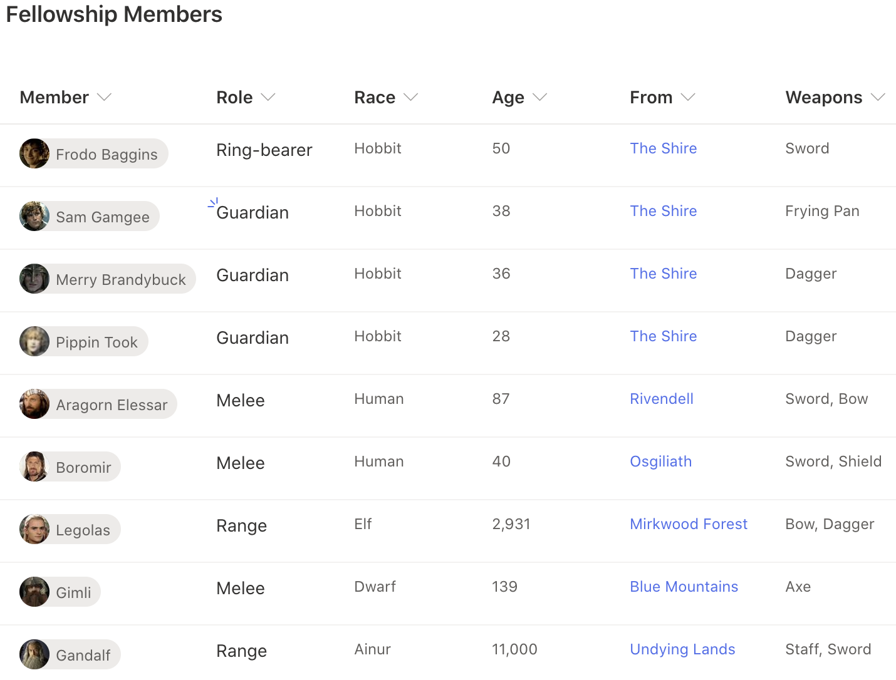

# Getting Started With Custom Formatting
## Summary
Contains several examples of using SharePoint's custom column formatting feature to convert this...

into this...

## List requirements
You will need two lists.

### Middle Earth Locales
*Middle Earth Locales* is used as a simple lookup list.

|Type|Internal Name|Display Name|Required|
|---|---|---|:---:|
|Single line of Text| Title |Title|True|

### Fellowship Members
The main list that stores information about the members of the Fellowship.

|Type|Internal Name|Display Name|Required|
|---|---|---|:---:|
|Single line of Text| Title |Role|True|
|People|Member|Member|False|
|Choice|Race|Race|False|
|Multi-Choice|Weapons|Weapons|False|
|Number|Age|Age|False|
|Lookup|From|From|False

#### Race Choices
- Hobbit
- Human
- Dwarf
- Elf
- Ainur

#### Weapon Choices
- Sword
- Shield
- Dagger
- Staff
- Frying Pan
- Axe
- Bow

## Samples
|Solution|Author(s)|
|---|---|
| [Hello World Sample - Part 1.json](Column%20Formatting/Hello%20World%20Sample%20-%20Part%201.json) |[Will Holland](http://twitter.com/_wcholland)|
| [Hello World Sample - Part 2.json](Column%20Formatting/Hello%20World%20Sample%20-%20Part%202.json) |[Will Holland](http://twitter.com/_wcholland)|
| [Age.json](Column%20Formatting/Age.json) |[Will Holland](http://twitter.com/_wcholland)|
| [From.json](Column%20Formatting/From.json) |[Will Holland](http://twitter.com/_wcholland)|
| [Member.json](Column%20Formatting/Member.json) |[Will Holland](https://twitter.com/_wcholland)|
| [Race.json](Column%20Formatting/Race.json) |[Will Holland](https://twitter.com/_wcholland)|
| [Role.json](Column%20Formatting/Role.json) |[Will Holland](https://twitter.com/_wcholland)|
| [Weapons.json](Column%20Formatting/Weapons.json) |[Will Holland](https://twitter.com/_wcholland)|

## Version history

Version|Date|Comments
-------|----|--------
1.0|March 13, 2021|Initial release

## Disclaimer
**THIS CODE IS PROVIDED *AS IS* WITHOUT WARRANTY OF ANY KIND, EITHER EXPRESS OR IMPLIED, INCLUDING ANY IMPLIED WARRANTIES OF FITNESS FOR A PARTICULAR PURPOSE, MERCHANTABILITY, OR NON-INFRINGEMENT.**
